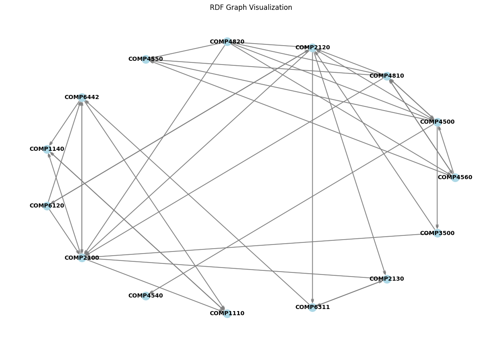

# ANU Course Depednecy lookuper

This is the code that crawls the ANU programm  and courses page and converts the prequsite of target course to in-memory representation.

Moreovever, the graph could be converted to a rdf representation that allow further application

